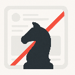
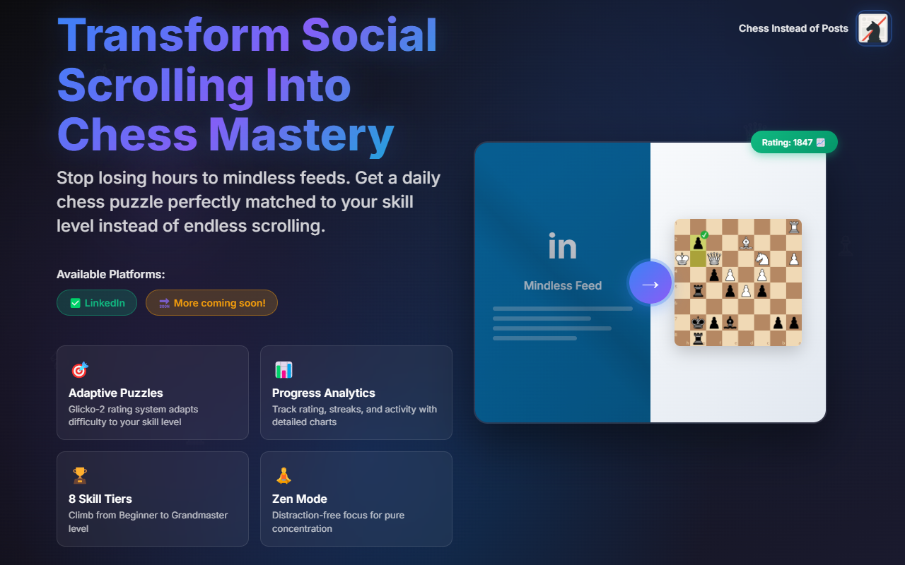
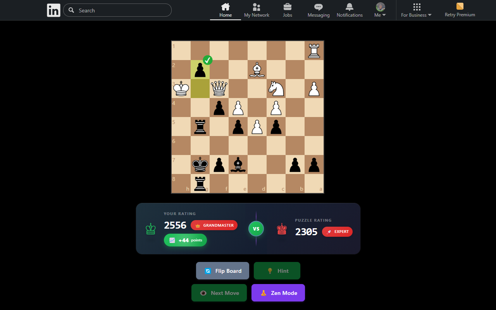
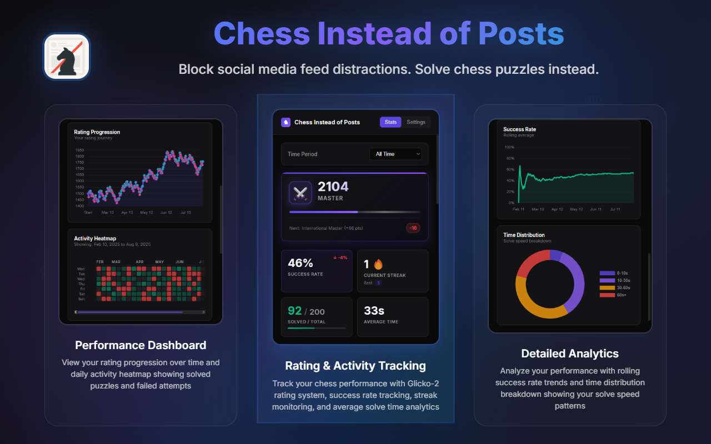

<div align="center">



# Chess Instead of Posts

[](https://chromewebstore.google.com/detail/chess-instead-of-posts/jaagjgijdgnpfmmjnkdeianmmhebfglf)
[](https://addons.mozilla.org)
[](./LICENSE)

*Transform your social media into chess mastery. One puzzle at a time.*

</div>

---

<div align="center">
  
</div>

## 🎯 What it does

Instead of getting lost in endless social media posts, you'll solve chess puzzles perfectly matched to your skill level.

<div align="center">
  
</div>

## ✨ Features

<table>
<tr>
<td width="50%">

### 🧩 **Smart Puzzle Matching**
- **Adaptive Mode**: Puzzles scale with your rating
- **Daily Mode**: Community competition
- Beginner to grandmaster difficulty

</td>
<td width="50%">

### 📊 **Comprehensive Analytics** 
- Real-time rating tracking
- Activity heatmaps
- Performance insights

</td>
</tr>
<tr>
<td>

### 💰 **Completely Free**
- No premium features
- No subscriptions
- Full functionality for everyone

</td>
<td>

### 🏆 **8-Tier Progression**
- Beginner → Grandmaster
- Visual badges & milestones
- Clear improvement goals

</td>
</tr>
<tr>
<td colspan="2">

### 🧘 **Distraction-Free Experience**
- **Zen Mode**: Board-only focus
- **Instant Blocking**: No feed flash
- Clean, minimal interface

</td>
</tr>
</table>

<div align="center">
  
</div>

---

## 🚀 How it works

```
1️⃣ Install → 2️⃣ Visit Supported Platforms → 3️⃣ Solve Puzzles → 4️⃣ Track Progress → 5️⃣ Level Up
```

## 🌐 Supported Platforms

| Platform | Status |
|----------|--------|
| **LinkedIn** | ✅ Available |
| **Twitter** | 🔜 Coming Soon |
| **Instagram** | 🔜 Coming Soon |
| **TikTok** | 🔜 Coming Soon |

---

## 🔧 Installation

**[Chrome Web Store](https://chromewebstore.google.com/detail/chess-instead-of-posts/jaagjgijdgnpfmmjnkdeianmmhebfglf)**  
**[Firefox Add-ons](https://addons.mozilla.org)** *(link coming soon)*

<details>
<summary><strong>📦 Install from source</strong></summary>

1. Clone this repository
2. Open Chrome → `chrome://extensions/`
3. Enable "Developer mode"
4. Click "Load unpacked" → select folder

</details>

---

## 🔒 Privacy & Technical

- 🚫 **No data collection** - everything stays local
- 📱 **No account required** - install and play
- ⚡ **Lightweight** - minimal performance impact
- 🧠 **Glicko-2 rating system** - accurate skill assessment

---

## 🤝 Contributing

Issues and PRs welcome! Made with ❤️ for chess enthusiasts.

---